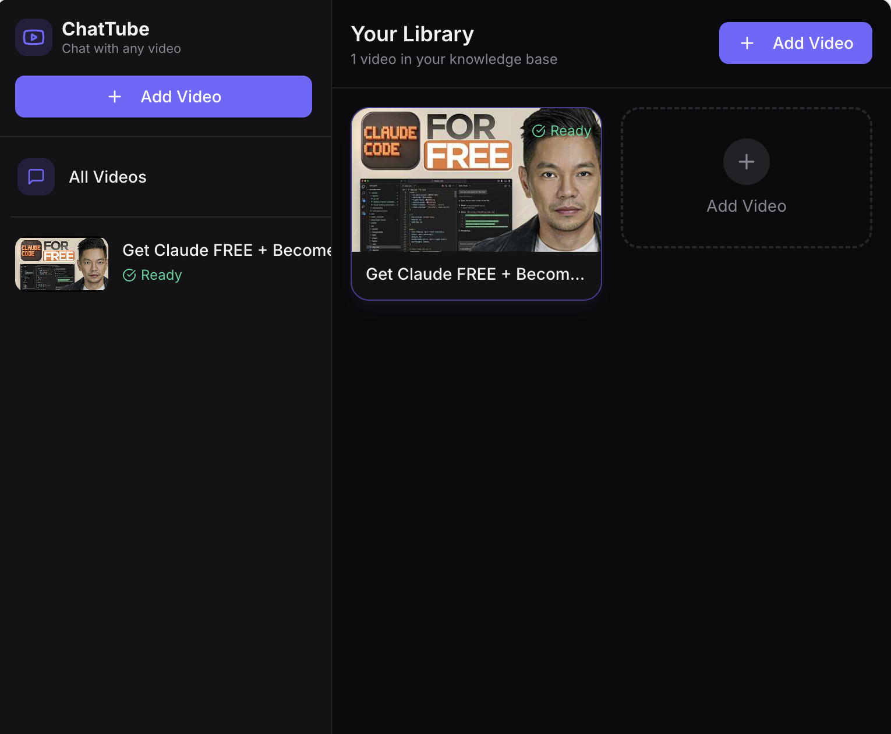
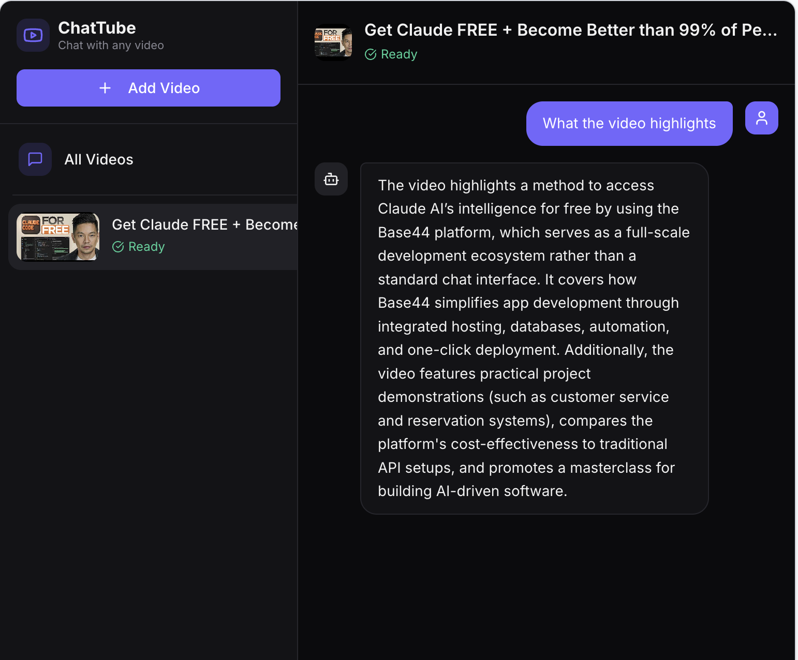

# 🎥 ChatTube.ai (Next.js + RAG, deployable on Vercel)

**▶ Live demo: [chattube-ai-self.vercel.app](https://chattube-ai-self.vercel.app/)**

An interactive chatbot that answers questions about any YouTube video using
**Retrieval-Augmented Generation (RAG)**. Paste a video — a recorded interview,
a role overview, a company-culture clip, or a candidate's video intro — and ask
questions. Answers are grounded **only** in that video's transcript.

This is a learning project for building AI agents. It's a full rewrite of the
original Streamlit + Embedchain app into a **Next.js** app that deploys to
**Vercel** with **no external database**.

## Screenshots

**Library — your knowledge base of ingested videos**



**Chat — ask questions answered only from the video's transcript**



### Signature features
- **ChatTube-style UI** — a library of videos, per-video chat, and an Add-Video modal.
- **Topic-aware background** — the LLM extracts visual keywords from the video and
  the page background loads a matching photo (cars & travel → road imagery), via
  the key-free LoremFlickr service (`app/components/TopicBackground.tsx`).
- **Topic timeline scrubber** — the LLM segments the transcript into timestamped
  chapters; a slider shows which topic is discussed when, with deep-links that
  open YouTube at that moment (`app/components/Timeline.tsx`, `lib/analyze.ts`).

---

## Why this design (the AI-engineering ideas worth keeping)

**1. RAG in five explicit steps.** The whole app is just this pipeline, and each
step lives in an obvious place:

| Step | What happens | Where |
|------|--------------|-------|
| 1. Load | Fetch the video transcript | `lib/youtube.ts` |
| 2. Chunk | Split into overlapping windows | `lib/rag.ts` → `chunkText` |
| 3. Embed | Turn chunks into vectors | `lib/llm.ts` → `embed` |
| 4. Retrieve | Rank chunks by cosine similarity to the question | `lib/rag.ts` → `retrieve` |
| 5. Generate | Feed top chunks to the LLM as context | `app/api/chat/route.ts` |

**2. A swappable provider seam.** `lib/llm.ts` is the *only* file that imports an
AI SDK. Everything else calls `embed()` and `chat()`. Swap OpenAI for Anthropic,
Groq, Cohere, or a local model by editing that one file. (You said "keep the
stack flexible" — this is how.)

**3. No database, fully serverless.** For one video the corpus is tiny (dozens of
chunks), so we do a brute-force cosine scan in memory. The browser holds the
embedded chunks in React state and sends them back with each question, so the
Vercel functions stay stateless. When you outgrow this, replace steps 3–4 with a
vector DB (Pinecone / Supabase pgvector) — the `retrieve()` function is the seam.

---

## Project structure

```
app/
  layout.tsx           Root layout
  page.tsx             The chat UI (client component)
  globals.css          Styles
  api/
    ingest/route.ts    POST: transcript → chunk → embed → return chunks
    chat/route.ts      POST: retrieve top chunks → generate grounded answer
lib/
  youtube.ts           Transcript loader + URL/ID parsing
  rag.ts               Chunking, cosine similarity, retrieval
  llm.ts               Provider abstraction (embed + chat) — swap here
.env.example           Copy to .env.local and fill in your key
```

The original Python files (`chat_youtube.py`, `requirements.txt`) are kept for
reference but are not used by the Next.js app.

---

## Run it locally

Requires Node.js 18+.

```bash
# 1. Install dependencies
npm install

# 2. Add your API key
cp .env.example .env.local
#   then edit .env.local and set OPENAI_API_KEY

# 3. Start the dev server
npm run dev
```

Open http://localhost:3000, paste a YouTube URL, click **Load video**, and ask
questions.

> **Tip:** Use a video that has captions. Music videos and brand-new uploads
> often have captions disabled, and the app will tell you if no transcript exists.

---

## Deploy to Vercel

1. Push this folder to a GitHub repository.
2. Go to [vercel.com/new](https://vercel.com/new) and import the repo.
3. In **Project Settings → Environment Variables**, add:
   - `OPENAI_API_KEY` — your key (required)
   - `CHAT_MODEL` — optional, defaults to `gpt-4o-mini`
   - `EMBEDDING_MODEL` — optional, defaults to `text-embedding-3-small`
4. Click **Deploy**.

Vercel auto-detects Next.js — no extra configuration needed. The API routes run
as serverless functions; `maxDuration = 60` gives long transcripts time to embed.

Alternatively, from the CLI:

```bash
npm i -g vercel
vercel        # follow prompts, then set env vars in the dashboard
vercel --prod
```

---

## Environment variables

| Variable | Required | Default | Purpose |
|----------|----------|---------|---------|
| `OPENAI_API_KEY` | ✅ | — | Auth key (OpenAI **or** OpenRouter) |
| `OPENAI_BASE_URL` | ❌ | OpenAI | Set to `https://openrouter.ai/api/v1` to use OpenRouter |
| `CHAT_MODEL` | ❌ | `gpt-4o-mini` | Chat model (e.g. `openrouter/free`) |
| `EMBEDDING_MODEL` | ❌ | `text-embedding-3-small` | Embedding model |
| `APP_URL` | ❌ | `http://localhost:3000` | Optional; shown in OpenRouter dashboard |

### Free option: OpenRouter

The app works with any OpenAI-compatible provider. To run it **for free**, use
[OpenRouter](https://openrouter.ai/keys) — one key covers both chat and
embeddings. In `.env.local`:

```
OPENAI_API_KEY=sk-or-your-openrouter-key
OPENAI_BASE_URL=https://openrouter.ai/api/v1
CHAT_MODEL=openrouter/free          # auto-picks an available free model
EMBEDDING_MODEL=qwen/qwen3-embedding-8b
```

Free models are rate-limited and their slugs change often — check
[openrouter.ai/models](https://openrouter.ai/models?max_price=0) for current free
options. If an embedding model errors, swap `EMBEDDING_MODEL` for another from
that list. To go back to OpenAI, just remove `OPENAI_BASE_URL` and use an
`sk-...` key.

---

## Abuse protection (public deployments)

Because the live site runs on your OpenRouter key, both API routes are rate
limited per IP (`lib/ratelimit.ts`): ingest allows 8 videos / 10 min, chat
allows 30 questions / 10 min, and any single video is capped at 150 chunks to
bound cost. This is an in-memory, best-effort guard — good enough to stop casual
abuse. On Vercel each serverless instance has its own memory, so for a strict
global limit, back it with [Upstash Redis](https://upstash.com) +
`@upstash/ratelimit` (free tier) and swap the store in `lib/ratelimit.ts`.

## Ideas to extend (good learning next steps)

- **Swap the LLM provider** in `lib/llm.ts` (e.g. Anthropic Claude for chat).
- **Add a real vector DB** (Pinecone/Supabase) so multiple videos persist.
- **Stream responses** using the Vercel AI SDK for a typing effect.
- **Multi-video hiring workspace**: index several candidate videos and compare.
- **Structured hiring output**: have the model return JSON (strengths, skills,
  red flags) instead of prose, and render it as a scorecard.

---

## How it maps to "chat with a YouTube video"

Same core idea as the original Streamlit tutorial (RAG over a video transcript),
re-implemented with:

- **Streamlit → Next.js** (a real web framework that deploys to Vercel)
- **Embedchain → hand-written pipeline** (so you can see every step)
- **ChromaDB → in-memory cosine search** (no service to run)
